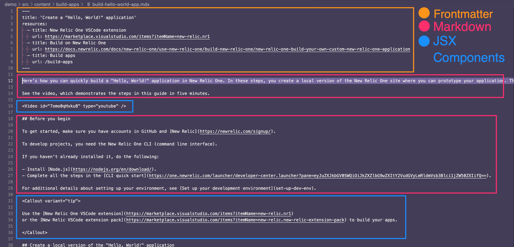
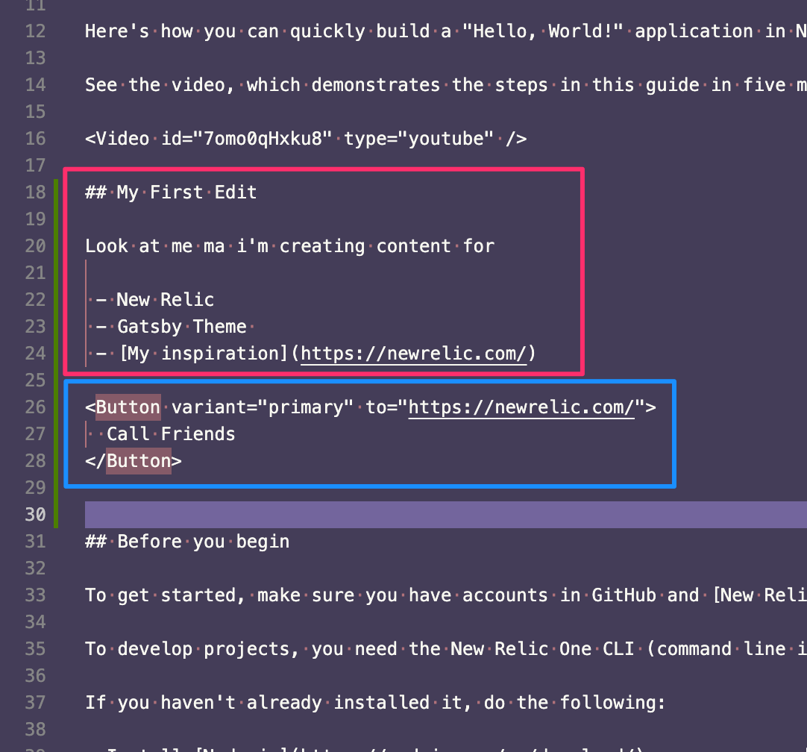
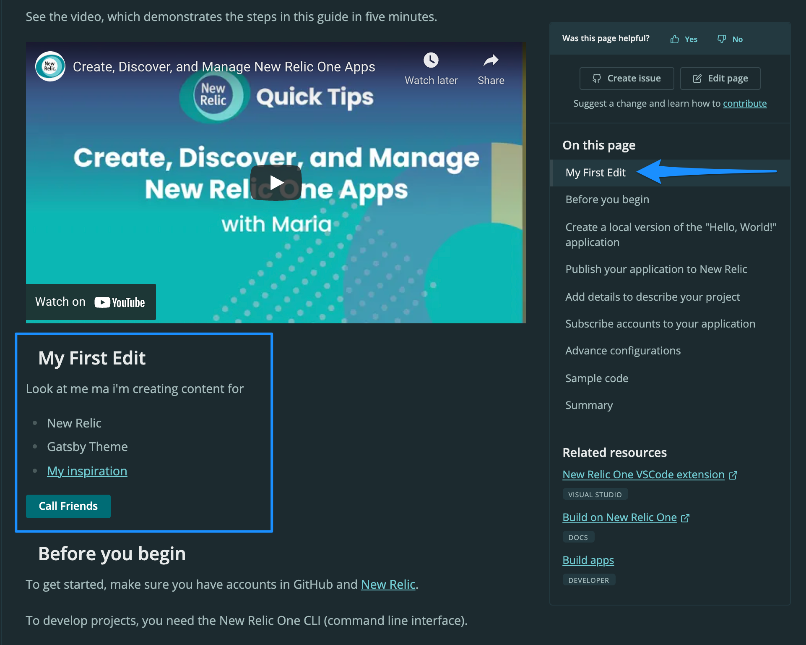

[](https://opensource.newrelic.com/oss-category/#community-project)

# Gatsby New Relic Themes

This repo contains Gatsby themes used by New Relic Gatsby sites, including:

- [docs.newrelic.com](https://docs.newrelic.com) - [GitHub repository](https://github.com/newrelic/docs-website)
- [newrelic.com/instant-observability](https://newrelic.com/instant-observability) - [GitHub repository](https://github.com/newrelic/instant-observability-website)
- [developer.newrelic.com](https://developer.newrelic.com) - [GitHub repository](https://github.com/newrelic/developer-website)
- [opensource.newrelic.com](https://opensource.newrelic.com) - [GitHub repository](https://github.com/newrelic/opensource-website)

## Installation

In your terminal:

```sh
git clone git@github.com:newrelic/gatsby-theme-newrelic.git
cd gatsby-theme-newrelic
yarn
```

## Getting started

You can use the `Demo Site` included to test out changes to the theme. It's a much smaller package to build and serve than our other sites, so it's ideal for testing out changes to plugin behaviour, styling and our component library.

To run the `Demo Site`, simply use either of the following commands:

```sh
yarn start
```

...or...

```sh
yarn workspace demo develop
```

It should only take `~30 seconds` to build and you should see...

```sh
success Building development bundle
```

...in the terminal, then you can visit [http://localhost:8001](http://localhost:8001) in your browser :)

## Editing Content

We use MDX files for content which lets you seamlessly write JSX in your Markdown documents. This means you can write content in regular Markdown format as well as including React componenets in the same file. Gatsby will then do all the heavy-lifting to convert these to HTML to serve in the browser.

### Example

For this example we will show how to add some content to a page and see the render results in the browser. We will use the `build-hello-world-app` document for testing, so with the **develop** server still running, navigate to and open the following in your favourite code editor:

- `demo/src/content/build-apps/build-hello-world-app.mdx`

You should see something like the following (possibly less wine coloured):



1. **Frontmatter** - This is `key/value` metadata you can provide for Gatsby which we won't go into now, but you can read more about [here](https://www.gatsbyjs.com/docs/mdx/writing-pages/#using-frontmatter-in-mdx)
2. **Markdown** - This is regular Markdown language, and we'll include [a guide on writing Markdown](https://www.markdownguide.org/) as well as a great [resource for practicing online](https://stackedit.io/app#)
3. **JSX/Components** - These are the React components to super-charge your content, you can see the full list of components included in the theme [here](packages/gatsby-theme-newrelic#components)

#### Add some Markdown and JSX

Firstly we'll add some standard Markdown to the page, including a Header, bulleted list and link. Feel free to edit the examples:

```md
## My First Edit

Look at me ma i'm creating content for

 - New Relic
 - Gatsby Theme
 - [My inspiration](https://newrelic.com/)
```

Next we'll add a **Button** component that links to a site when you click it:

```md
<Button variant="primary" to="https://newrelic.com/">
  Call Friends
</Button>
```

Your code should now look something like this...




...and as long as your **develop** server is still running the page should automatically reload with the new content...




Because we've added a Header, `My First Edit` should now be included in the `On this page` section on the right.  Fresh! :D

### Further Editing

With your new found confidence, check out the full documentation for the theme where you'll find more examples for:

 - [Configuration](packages/gatsby-theme-newrelic#configuration)
 - [Components](packages/gatsby-theme-newrelic#components)
 - [MDX Component variants](packages/gatsby-theme-newrelic#mdx-component-variants)
 - [Hooks](packages/gatsby-theme-newrelic#hooks)


## Testing

We're currently developing this package, and will provide test information as
we build out the library.

## Support

New Relic hosts and moderates an online forum where customers can interact with
New Relic employees as well as other customers to get help and share best
practices. Like all official New Relic open source projects, there's a related
[Community topic](https://discuss.newrelic.com/t/announcing-a-new-relic-gatsby-site-theme/109814)
in the New Relic Explorers Hub.

## Contributing

We encourage your contributions to improve `gatsby-theme-newrelic`! Keep in mind
when you submit your pull request, you'll need to sign the CLA via the
click-through using CLA-Assistant. You only have to sign the CLA one time per
project. If you have any questions, or to execute our corporate CLA, required
if your contribution is on behalf of a company, please drop us an email at
opensource@newrelic.com.

## License

`gatsby-theme-newrelic` is licensed under the [Apache
2.0](http://apache.org/licenses/LICENSE-2.0.txt) License.

> The gatsby-theme-newrelic also uses source code from third-party libraries.
> You can find full details on which libraries are used and the terms under
> which they are licensed in the third-party notices document.
